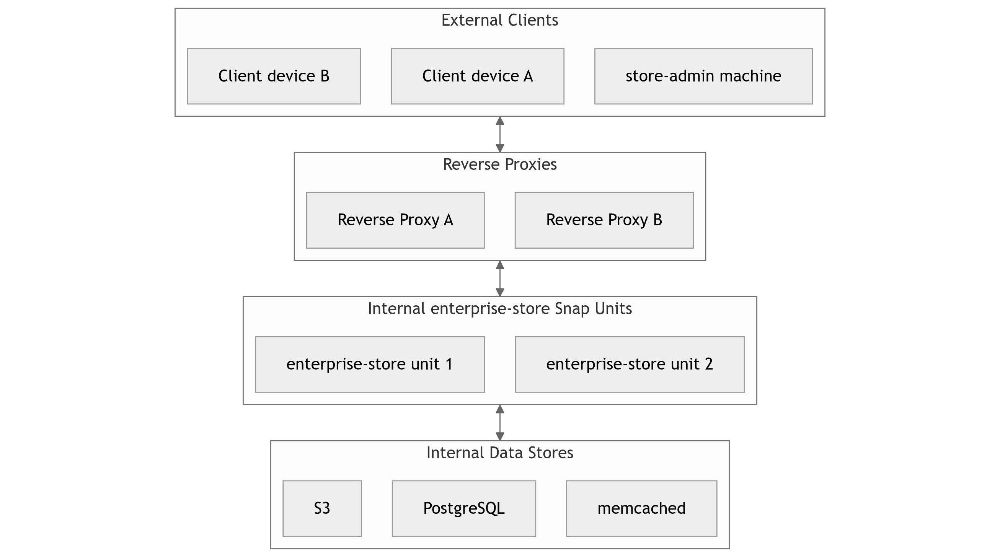

# Enable High-Availability (HA)
By default, the Enterprise Store does not use a High Availability
configuration; if the machine with the Enterprise Store snap goes down,
then any requests made to it will fail.

Enterprise Store operators can opt to use a HA configuration, which
allows for multiple machines ("units") with the Enterprise Store snap
to be used for serving client requests. In this scenario, if one unit
goes down, then requests can be routed to another live unit.

## Overview
Below is a diagram of an example HA network topology:



At a high-level, the recommended approach for setting up HA is:

1. Fully configure a single Enterprise Store (ES) unit, including
relevant HA config options
2. Set up and configure at least one reverse proxy, using the
Enterprise Store unit as a backend server
3. Point devices/clients to the reverse proxy(s), verifying that
requests are working as intended
4. Create another ES unit, cloning over the relevant configuration
and files from the initial unit
5. Add the new unit as a backend/server to the reverse proxy(s)
6. Repeat steps 3-5 for the amount of units desired

## Configure the initial unit
Follow the documentation for [installation](install.md),
[registration](register.md) and/or [setting up an offline
store](airgap.md) depending on your use-case. These already assume the
use of a single unit, and a new Enterprise Store being set up. However,
there are some deviations to some of the steps in a HA setup.

### TLS Termination
In HA setups, it is common to terminate the TLS connection at the
reverse proxy, with traffic to the backend units using unencrypted
HTTP, and devices/clients still communicating on a HTTPS connection. If
this is your desired network topology, then there is no need to
follow the HTTPS certificate setup for the ES unit outlined in
[Enhance Enterprise Store’s security](security.md), since HTTPS
will be configured on the reverse proxy(s) instead. Note that it is
important to indicate whether the Store expects client devices to
use HTTP or HTTPS traffic in the assertion via the appropriate
registration commands. For example, to set up a HTTPS Store, you
should specify:

    sudo enterprise-store register --https

or:

    store-admin register --offline "https://my-store.test"

to ensure that the correct protocol is encoded in the store assertion
used by client devices.

### Pin the snap

It is recommended to pin the enterprise-store snap on the
unit to to prevent automatic updates:

    sudo snap refresh --hold enterprise-store

```{note}
Issues may be encountered if running multiple enterprise-store versions
in the same HA cluster.
```

### Connect to PostgreSQL
See the [installation](install.md) guide for setting up and connecting
to a PostgreSQL server. To the connect to database, set the connecting
string:

    sudo enterprise-store config proxy.db.connection="postgresql://snapproxy-user@pghost.test:5432/snapproxy-db"

### Use a HA memcached or replace usage with PostgreSQL
By default, a single-unit Enterprise Store makes use of a local
memcached instance for storing time-bound data like nonces. For HA,
we need to either use PostgreSQL as the data store for the time-bound
data, or point the units to a separate, dedicated memcached cluster.

#### Use PostgreSQL
To use PostgreSQL instead of memcached, run:

    sudo enterprise-store config proxy.use-postgres-over-memcached="true"

```{warning}
The above option currently does not currently support the
[On-Prem Model Service](on-prem-model-service.md).
```

#### Use Memcached
To use memcached instance(s), set the connection strings with:

    # For a single instance
    sudo enterprise-store config proxy.memcached.connection='["memcached-1.test"]'
    # For multiple instances
    sudo enterprise-store config proxy.memcached.connection='["memcached-1.test","memcached-2.test"]'

The Enterprise Store uses `pymemcache` to distribute
data across a memcached cluster. See the [pymemcache
documentation](https://pymemcache.readthedocs.io/en/latest/getting_started.html#using-a-memcached-cluster)
for details on how the distribution works.

### Connect to S3 (offline store)
For an offline Enterprise Store, the unit must be configured to use
S3 as a blob storage backend.  The configuration options for S3 start
with `proxy.storage.s3`.

You will need to set the following options:

    # S3 server URL. Must be HTTP or HTTPS
    sudo enterprise-store config proxy.storage.s3.server-url="https://s3-server.test:9000"

    # S3 access key ID. For MinIO deployments, this is the username.
    sudo enterprise-store config proxy.storage.s3.access-key-id="admin"

    # S3 secret access key. For MinIO deployments, this is the password.
    sudo enterprise-store config proxy.storage.s3.secret-access-key="password"

    # S3 region. Leave as the default "us-east-1" if unsure
    sudo enterprise-store config proxy.storage.s3.region="us-east-1"

    # Whether to use path-style addressing for S3. The default is "true".
    sudo enterprise-store config proxy.storage.s3.use-path-style="true"

    # Name of the unscanned bucket, used for storing unscanned packages.
    # The default name is "unscanned-production". If it does not exist
    # on the server, it will be automatically created once the switch
    # is made to the S3 backend. It is advisable to check if the default
    # bucket name is already in use.
    sudo enterprise-store config proxy.storage.s3.unscanned-container-name="unscanned-production"

    # Name of the scanned bucket, used for storing scanned packages.
    # The default name is "scanned-production". If it does not exist on
    # the server, it will be automatically created once the switch is
    # made to the S3 backend. It is advisable to check if the default
    # bucket name is already in use.
    sudo enterprise-store config proxy.storage.s3.scanned-container-name="scanned-production"

When using a HTTPS connection to the S3 bucket, you will also need
to configure the unit to be able to verify the certificate from the
S3 server. To add a certificate on the unit, run:

    sudo cp s3-certificate.crt /usr/local/share/ca-certificates/
    sudo update-ca-certificates
    sudo systemctl restart snapd

Finally, switch to using S3 as the storage backend with:

    sudo enterprise-store config proxy.storage.backend="s3"

Verify that it works by running:

    enterprise-store status

There should be no failing services, especially
`snapstorage`. Additionally, you can verify that the relevant buckets
have been automatically created in the S3 server.

### Make the unit reverse proxy aware
Enterprise Store operators are expected to properly configure the
reverse proxy(s) to set the `X-Forwarded-Proto` header (see the next
section below for more info).

To make the backend unit trust this header, run:

    sudo enterprise-store config proxy.trust-forwarded-proto="true"

```{warning}
The unit should not be directly exposed to traffic from
devices/clients when this is enabled; the traffic must come from
the reverse proxy(s), and the header should be set appropriately.
```

## Configure the reverse proxy(s)
Reverse proxies like HAProxy or NGINX are situated between clients
and the backend Enterprise Store units. They need to be configured
correctly to interact with the backend units.

Reverse proxies must set the `X-Forwarded-Proto` HTTP
header appropriately depending the protocol used by the client
(`http`/`https`). Unsupported protocols should be denied. For example,
if you don't want to handle unencrypted HTTP traffic with clients,
then the reverse proxy should deny the request (or upgrade the
connection to HTTPS). Clients should not be able to directly set
the `X-Forwarded-Proto` header in their requests; only the reverse
proxy should.

Reverse proxies should also specify the relevant backend units in
the configuration.

An example portion of a HAProxy configuration might look like:
```
frontend my_frontend
  mode http
  # Use HTTPS
  bind *:443 ssl crt /etc/ssl/private/reverse-proxy.pem
  # Set the X-Forwarded-Proto header appropriately
  http-request add-header X-Forwarded-Proto https if { ssl_fc }
  # Uncomment and use section below if using HTTP instead
  # bind *:80
  # http-request add-header X-Forwarded-Proto http if !{ ssl_fc }
  default_backend web_servers

backend web_servers
  mode http
  balance roundrobin
  # Add health checks to units
  option httpchk HEAD /_status/check
  server s1 unit-ip-1.test:80 check
```

Don't forget to restart the reverse proxy to pick up the config.

## Point devices to the reverse proxy
See [how to configure devices](devices.md).

You may also have to trust the certificate served by the
reverse proxy(s) on the device if using HTTPS:

    sudo cp reverse-proxy.crt /usr/local/share/ca-certificates/
    sudo update-ca-certificates
    sudo systemctl restart snapd

At this point, verify that functionality is working as expected for
client devices.

## Add another unit
### Install the snap
To add another unit to our topology, we need to provision a new machine
and install the `enterprise-store` snap, using the same revision
as the other unit. This could mean running the same `install.sh`
script as on the other unit, or finding its revision with:

    snap list enterprise-store

Then install on the new unit with:

    sudo snap install enterprise-store --revision=<revision>

Or for an offline install of a downloaded snap:

    sudo snap ack enterprise-store_<revision>.assert
    sudo snap install enterprise-store_<revision>.snap

After installing, remember to pin the snap:

    sudo snap refresh --hold enterprise-store

### Export and import the config
Next, export the config from the existing enterprise-store unit:

    sudo enterprise-store config --export-yaml | cat > store-config.yaml

```{warning}
Note that this YAML file includes sensitive data like secrets.
```

We also need a copy of the store assertion file at:

    /var/snap/enterprise-store/common/nginx/airgap/store.assert

Next, copy over the `store-config.yaml` and `store.assert` files to
the newly provisioned unit.

On the new unit, import the `store-config.yaml` file:

    cat store-config.yaml | sudo enterprise-store config --import-yaml

Then move the `store.assert` file to the appropriate location:

    sudo cp store.assert /var/snap/enterprise-store/common/nginx/airgap/store.assert

You may also need to repeat any other relevant configuration steps
from the initial unit, such as trusting the S3 certificate.

Verify that the unit is okay:

    enterprise-store status
    enterprise-store check-connections

Next, add the unit to the reverse proxy as a backend. Following the
HAProxy example above, the configuration might look like:

```
backend web_servers
  mode http
  balance roundrobin
  # Add health checks to units
  option httpchk HEAD /_status/check
  server s1 unit-ip-1.test:80 check
  server s2 unit-ip-2.test:80 check
```

Don't forget to restart the reverse proxy to pick up the configuration
changes.

## Keep backups
It is advisable to maintain frequent backups of various components
of the Enterprise Store. These backups include:

* Enterprise Store unit configs (including secrets)
* PostgreSQL data
* S3 data
* Private keys, certificates and configuration of other components
of the network topology (such as reverse proxies, memcached, etc.)

## Keep unit configuration consistent
It is important for the Enterprise Store configuration to be the same
across units within the same cluster. Divergent configurations will likely
lead to divergent behaviour when handling requests.

One way of checking that unit configurations are consistent is to
compare the hash of the configuration options across the units using:

    # Run the following across the units
    sudo enterprise-store config --export-yaml | sha256sum

It is also advisable to ensure that, before and after running commands
on an Enterprise Store unit, you check that the configuration has
not changed. For example:

    # Note the config hash before running the command
    sudo enterprise-store config --export-yaml | sha256sum

    # Could be any command, we're just using `config` as an example
    sudo enterprise-store config proxy.cache.size="4096"

    # Compare the config hash after running the command
    sudo enterprise-store config --export-yaml | sha256sum

In the case of divergent configuration, you should replicate
the desired configuration across the units, following the YAML
export/import instructions from above.
